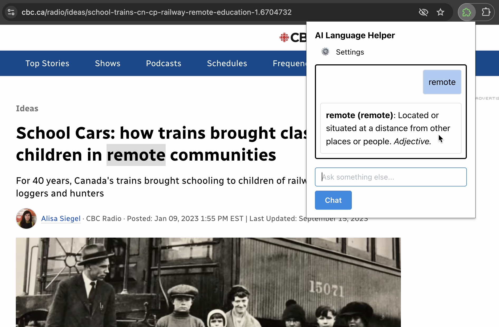

# AI Language Helper Extension

A browser extension that can be used to look up the meaning of words on any web page.

> [Watch the demo video ](https://vimeo.com/1031231899)

<p align="center">

</p>


Features:
* Look up the meaning of any word by right-clicking and selecting "Explain with AI Language Helper" from the context menu
* Translations/explanations are provided by Gemini Nano using the experimental [prompt API](https://developer.chrome.com/docs/ai/built-in-apis#prompt_api).
* Ask follow-up questions to the LLM using the chat interface
* English 🇬🇧 and Spanish 🇪🇸 can be selected as input languages
* Optionally use a Gemini API Key or local Ollama model instead of Gemini Nano

<p align="center">
 
</p>

<p align="center">
 
</p>

## Build instructions

To build the extension:
```
npm install
npm run build
```

Install the extension from `./build/chrome-mv3`
